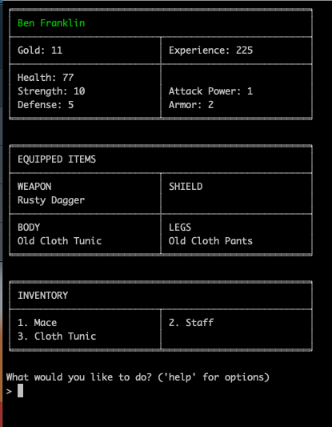

# Ruby CLI RPG game

## Install 
Currently needed only for test runner
`$ bundle install --path vendor/bundle`

## Test runner install 
`$ bin/rspec --init` 

## Run Tests 
`$ bin/rspec --format doc`

## Run game 
`$ ruby cli_rpg.rb`

## Screenshots 
  
  
  
  
  